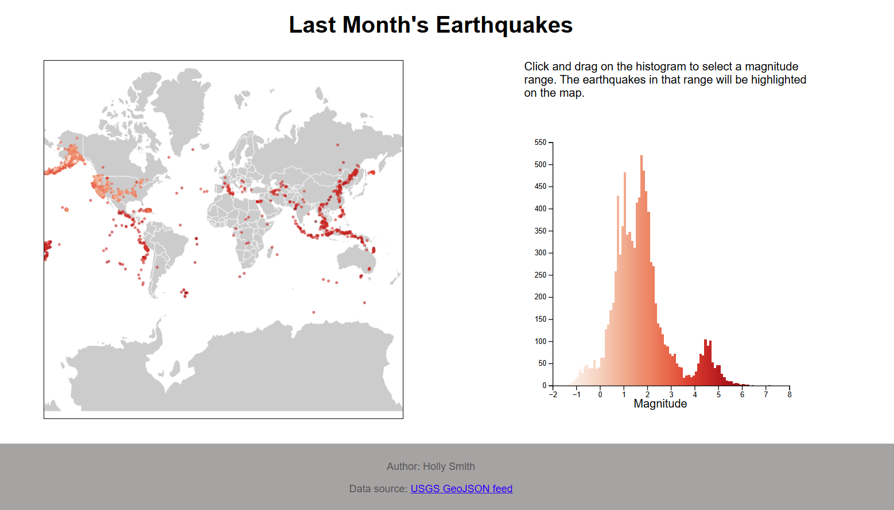

A4: Visualizing Earthquakes with Map and Histogram
===
Link to GitHub pages:

### Overview

This visualization features a map of the world on the left-hand side with circles representing earthquakes. On the right-hand side, there is a histogram of the magnitudes of those same earthquakes. Brushing over the histogram will isolate earthquakes on the map whose magnitude falls in the selected range by outlining them in gray and turning all other magnitudes gray and highly transparent. Below is a screenshot and screen recording of the visualization. 

One thing I learned doing this visualization is that earthquakes can have negative magnitudes, who knew!

## Technical Achievements

* Use the USGS API to get live details on the last month's earthquakes
* Layer multiple elements into the mapG group (world map, earthquake paths, circles corresponding to earthquakes), in order to allow zooming and panning on just the visuals that are part of the map
* Brushing the histogram edits the opacity, color, and outline of earthquake dots
* Use a CSS grid layout to put linked visualizations side-by-side, or stacked if space does not allow
* Used color and axes scales to 

## Design Achievements
* Used a matching color scale in the map and histogram to easily tell relative magnitudes
* Removed gaps between histogram bars and created many buckets in the histogram so that the histogram is smooth and brushing can make more narrow selections
* Visualizations appear side by side so that the map and histogram can be viewed at once. If space doesn't allow, however, visualizations can appear side by side
  

References
---
From original project description:
- https://observablehq.com/@philippkoytek/d3-part-3-brushing-and-linking
- https://github.com/d3/d3-brush
- https://observablehq.com/collection/@d3/d3-brush
- https://observablehq.com/@d3/focus-context?collection=@d3/d3-brush
Additional:
- https://d3js.org/d3-zoom
- https://www.w3schools.com/css/css_grid.asp
